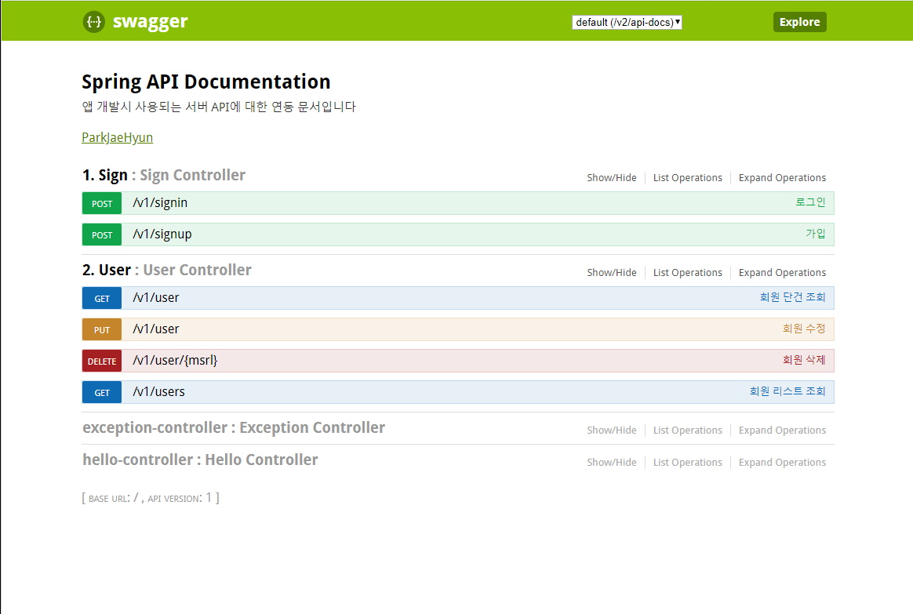

# Login-Logout-server-
Java Spring Boot를 이용해 로그인/로그아웃 서버 구현

---
Database : h2
h2.zip 파일도 올렸습니다. 
실행방법
1. 압축을 푼 다음 cmd 창을 킨다.
2. h2/bin/h2.bat 를 실행시켜준다.

---
JWT 토큰을 사용한 회원가입, 유저확인, 로그인, 회원삭제, 회원수정 

---

---

